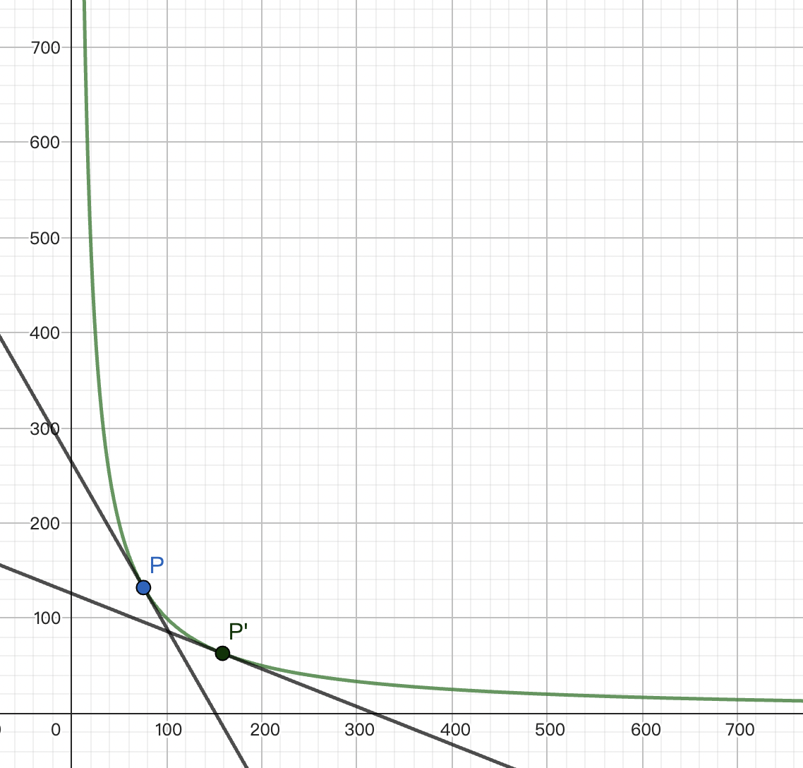
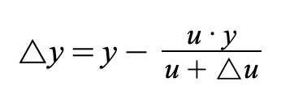
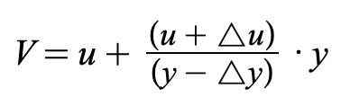
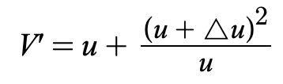
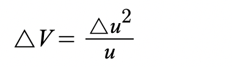

# 简介
恒定乘积是一种非常成功的 AMM 算法，其通过一个简单的公式```x*y=k```来确定资产价格和交易深度，解决了传统订单薄 DEX 深度连续性问题。将公式中的 x 和 y 视为可互换的两种资产，通过恒定乘积，可描述两种资产互换时的此消彼长的供需关系，并通过 x/y（或 y/x）描述其资产价格。
恒定乘积做市算法是 Uniswap 的核心算法，并被广泛应用于多个 DEX 系统中。恒定乘积做市的理论依据是价格与供需关系模型，

# 历史
恒定乘积 AMM 最早被实现和应用于大名鼎鼎的 Uniswap。其团队创始人之一 Hayden Adams 在 2018 年提出恒定乘积AMM的概念，并在同年发布了Uniswap v1版本，Uniswap成为第一个使用恒定乘积AMM算法的去中心化交易所。
但追溯历史，最早出现在 Vitalik 在 Reddit 中所写的一篇名为[《Let's run on-chain decentralized exchanges the way we run prediction markets》](https://www.reddit.com/r/ethereum/comments/55m04x/lets_run_onchain_decentralized_exchanges_the_way/)的文章。文章中描述了一种解决订单薄 Dex 高点差和高 Gas 费问题“链上做市商”机制，在文章最后，Vitalik 提出简化方案即 A * B = k 恒定乘积方法。

# 具体算法
顾名思义，恒定乘积就是将两种币/token 数量的乘积固定当其中一种 token发生数量变化时，另一种 token 的价格受固定乘积约束随之改变。

## 基本公式
```x*y=k```
x 和 y 分别代表一种币/token，二者的成绩恒定，所谓恒定，是指未对流通性池进行直接等值增减时的恒定。
当用户使用x资产兑换（购买或卖出都可视为兑换）y资产时，其向流动性池中注入△x资产，提取△y资产，此时，流动性池中x资产数量为x+△x，y资产数量为y-△y，由于恒定成绩的设定，兑换后：
``(x+△x)*(y-△y)=k``

## 价格计算
用户交易时，标记价格为``P=dx/dy``，其值等同于``P=x/y``。
在不考虑手续费的情况下，用户兑换的真实价格为：``P’=△x/△y``。

## 流动性池
CPMM支撑用户交易的核心就在于流动性池。流动性池代表流动性资产的深度，可视为该交易对的TVL。流动性越大，公式``x*y=k``中的k值越高，代表该交易对可用资金越多。
用户可以向流动性池中添加流动性，最理想的添加方式是同价值比例添加，原始流动性为``x+y``，此时池中x资产的价值与y资产价值同等，即``Vx=Vy``，在用户向池中注入新的流动性时，也需要保证注入资产的价值同等，即``△Vx=△Vy``。添加后流动性变为``x+△x+y+△y``。
在以CPMM为基础的DEX中，任何人都可以为交易对流动性池中提供流动性。

## 滑点
所谓滑点，是指实际成交价格与标记价格之间的差距，在上文价格计算中已知标记价格和实际价格的计算方法，当用户兑换资产时，实际价格与标记价格之间的差距``P'-P``即为“滑点”。
在流动性池一定的情况下，用户兑换资产比例越多，在反比曲线中的偏移越多，价格斜率改变越大，滑点越高。

当用户兑换一定数量的资产时，流动性池越大，用户兑换数量在反比例曲线中的偏移越小，价格斜率改变越小，滑点越低。
因此，增加流动性池可使交易滑点降低。

## 无常损失
用户在DEX中没一次交易，都会使资金池中的资产比例发生变化，此时若流动性提供者提取出其份额，也会是新的资产比例，价值会小于原比例计算的价值，这种损失便称为“无常损失”。
无常损失并不是绝对损失，而是与原始资产比例对比的相对损失，为方便计算，将上文的x资产视为稳定币资产u，有如下计算过程：
流通性提供者提供流动性资产``u+y``，当前y价格为``P=u/y``，该用户流动性份额总价值为``2u``。当交易用户交易使流动性池资产比例发生变化，对应流动性提供者的流动性份额也将发生变化，设变化为``△u``，首先计算y资产变化``△y``
初始资产乘积``u·y=k`` 
变化后资产乘积``(u+△u)·(y-△y)=k``
由此可得y次产变化



此时y资产价格``P'=(u+△u)/(y-△y)``
用户流动性份额总价值变为``2(u+△u)``
由此可见，若△u为正（代表y资产价格上涨），则流动性提供者的流动性份额总价值也将增值。
那所谓“损失”如何理解呢？
流动性提供者最初是的资产结构是u+y，若按照交易后的价格来计算其总价值应是
``V=u+P‘*y``
将P’带入可得



将△y带入可得



无常损失``△V=V’-V``，得出



这部分无常损失是指当资产价格发生变动时流动性份额总价值与持有原资产数量的当前价值的比较。
还可以这样理解无常损失：
当一种资产价格不断上涨时，流动性持有者会不断卖出此资产，相比于长持不卖者少赚的损失就是无常损失。
当一种资产价格不断下跌时，流动性持有者会不断购买此资产，相比于空仓不买者多亏的损失就是无常损失。


