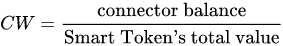

# bancor 协议
bancor 的命名来自于凯恩斯计划，该计划致力于引入一种名叫“Bancor”的超主权金货币，以推动二战后的国际货币兑换体系。
Bancor协议是想在智能合约的基础上实现具有去中心化流通性的Token交易网络。在交易市场中，有很多长尾 token 缺乏流动性。Bancor 通过提出智能 token 技术为这些长尾 token 提出了一种新的低成本的交易方式。
Bancor协议要求每个Token都需要提供“储备金”，储备金的比例每个Token自行定义（0～100%）。因为“储备金”的存在，每个Token天生通过Bancor协议可以交易，也就天生具备了去中心化流通性。使用Bancor协议进行交易的Token，Bancor协议称为“Smart Token”（智能Token）。
## 基本逻辑
Bancor 的核心公式如下：

CW 是 Connector Weight连接器比重。Connector balance 是连接器余额。Smart Token's total value 是智能 token 的市值。其计算如下：

带入核心公式，可得出：

Smart Token’s outstanding supply 为智能 token 的供应量。
在买卖过程中，通过以上公式进行汇率计算，并得出兑换数量。
买入过程：
买入可视为增加连接器代币余额同时获得增发部分的 supply。为方便计算，将上述 Price 公式因子进行缩写，P 表示 Price，R 表示 connector balance，S 表示 smart token supply，F 表示 CW。
简化后公式为：
对其微分计算：
由于 F 是常数，继续线向下推导可得：

当用户买入 token时，买入部分即增发部分 token，买入支付的费用进入连接器，则：
继续推导：

令α = 1/F -1 :

进行积分计算：

从而得出 P 与 S 的关系。

如果一个用户想要买总量为T的smart token，这样总供应量就会从 S0变为S0 +T，那么用户所需支付的费用为：

## 优缺点
优点：
1、采用“人机交易”模式，成交不依赖市场流动性。
2、无价差，由于买卖价格基于同一算法，导致交易时不会有价差产生。
3、价格敏感度可控，由于 CW 是设定参数，通过初始设定可以调整 token 的价格敏感度。

缺点：
1、无法应用于大额（只与储备金的比例）交易，大额交易会造成超高滑点。
2、深度确定，无法自适应市场热度。
3、合约操纵问题，合约 owner 可以改变 CW 参数（EOS RAM 和 FIBOS 都出现过），从而操纵价格走势。
## 延伸应用
**EOS RAM**
EOS RAM注定不会是一个非常大的市场容量，使用了Bancor协议后，却让这个小市场的流动性大大改善。
**FOMO 3D**
FOMO 3D 游戏中的 Key 即是使用 bancor 协议进行定价，使该游戏增加了跟多的博弈性，也使游戏规则更加完整。
## 理论基础
虽然在 bancor 的白皮书中没有提及相应的理论基础，但其余经济学中的价格弹性理论有着异曲同工之处。

* 当 CW = 1 时，提供100%的流动性，因此价格毫无弹性，一直维持在某一水平线上。
* 当 1 < CW < 1 时，即上述正常供需情况下的价格曲线。
* 当 CW > 1 时，整个曲线的斜率会变为对应的是吉芬商品（Giffen good）。
因此，CW 的设定对于 bancor 协议的利用极为关键。

