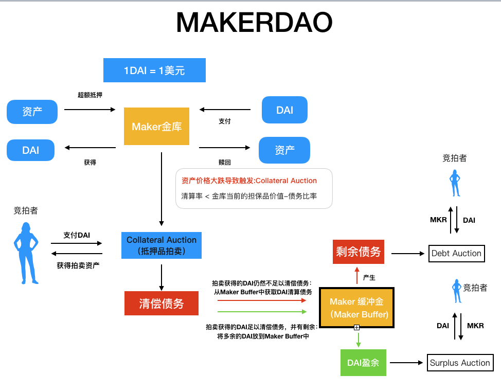

# 简介

MakerDAO是以太坊上的去中心化自治组织和智能合约系统，用户可以在系统中抵押以太坊和其他主流cryptocurrency折价获得稳定币Dai。MakerDAO本质是一套杠杆系统，通过MakerDAO，质押用户可以在保留以太坊的同时释放资产流动性。
MakerDAO主要有以下几部分构成：

* 质押借贷系统
* 拍卖清算系统
* 投票治理系统
  
MakerDAO中有发行了两种币：

* 稳定币DAI
* 治理代币MKR

# DAI

DAI是发行于MakerDAO上的一种稳定币，其价值锚定美元，通过超额抵押和清算机制来保证其价值。
DAI基本满足货币价值贮藏、交换媒介、记账单位、延期支付这四大功能。

# MKR

MKR是MakerDAO的治理代币，持有者可以通过投票来决定Maker协议的走向。投票合约中锁定的每一个 MKR 代币均等同于一票。

# 质押逻辑

用户调用Maker合约，向合约中质押支持的担保资产即可生成DAI，由于超额抵押设定，生成的DAI的数量范围会根据存入资产价值和清算抵押率来限定。
$$\large Q_{DAI}=\frac{Value_{ETH}}{Rate_{min}} $$

# 清算逻辑

当金库中抵押率低于**清算率**时，将有可能触发清算，每种金库类型都有各自的清算率，是 MKR 持有者基于不同担保品资产的风险状况投票决定的。
当金库触发清算时，Maker通过拍卖机制来进行清算，这种方式可以在无法获得担保物信息的情况下依然进行清算。

通过担保物拍卖获得的 Dai 会被用来偿还金库内的债务，其中包括清算罚金（Liquidation Penalty）。MKR 投票者会针对不同的担保物类型设定不同的清算罚金。

如果担保物拍卖上获得的 Dai 足以清偿金库内的债务，并足够支付清算罚金，该竞拍会转换成反向担保品竞拍（Reverse Collateral Auction）尽可能地减少担保物的出售数量。剩余的担保物都会物归原主。

如果担保物竞拍获得的 Dai 不足以清偿金库内的债务，亏损部分就会变成 Maker 协议的负债，由 Maker 缓冲金（缓冲金包括从担保物拍卖获得的收益（包含清算罚金），以及金库累积的稳定费用） 中的 Dai 偿还。如果缓冲金中没有足够的 Dai ，Maker 协议就会触发债务拍卖（Debt Auction）机制。在债务拍卖期间，系统会铸造新的 MKR（增加流通中的 MKR 量），出售给那些使用 Dai 来参与竞拍的用户。

## 拍卖机制

拍卖机制是Maker保障清算系统正常运行的核心。清算过程的拍卖有两种：

1. 抵押品拍卖（Collateral Auctions）：当借款人未能按时偿还贷款时，系统会通过抵押品拍卖来清算债务。抵押品拍卖的目标是以尽可能高的价格将抵押品出售，以弥补债务。这样可以确保稳定币的价值与锚定资产的价值之间保持稳定。抵押品拍卖使用的拍卖类型是英式拍卖（English Auction），在拍卖过程中，价格逐步下降，直到有买家愿意购买抵押品。

2. 债务拍卖（Debt Auctions）：当抵押品拍卖无法弥补全部债务时，系统会进行债务拍卖。债务拍卖的目标是将未偿还的债务以折扣价出售给投标者，从而吸引更多的资金进入系统。债务拍卖使用的拍卖类型是倒计时拍卖（Dutch Auction），拍卖的起始价格高于市场价，然后价格逐渐下降，直到有买家愿意接受价格并购买债务。
   
3. 缓冲金：缓冲金包括从担保物拍卖获得的收益（包含清算罚金），以及金库累积的稳定费用。在 Maker 缓冲金达到一定规模（由 Maker 治理决定）后，盈余部分会进入盈余拍卖，回购 MKR，销毁其总量。盈余数量是除去系统债务（比如担保品拍卖中未偿金库债务、DSR 支出）后的净值。

*
图片引用Dapp-Learning-DAO
*

## 预言机
Maker 协议需要实时了解 Maker 金库中充当担保物的资产的市场价格，从而知道何时触发清算机制。Maker中所有币的价格都是通过预言机传送，为防止价格攻击，MakerDAO设有预言机安全模块（OSM）来抵御风险。

**OSM**
Maker喂价预言机安全模块主要有以下机制：

1. 多个独立的喂价预言机：MakerDAO使用多个独立的喂价预言机来获取市场数据。这些预言机由不同的实体或组织运营。
2. 中位数价格：多个预言机向Medianizer合约喂价，采用中位数机制来确定最终的价格。它排除了价格数据中的异常值或操纵尝试。
3. 延迟喂价：预言机安全模块(OSM) 可以通过将喂价数据延迟一小时，进行保护。此让 MKR 代币持有者有时间识别喂价系统的漏洞或攻击。需要注意的是，延迟喂价不适用于抵押品。
4. 白名单机制：可参与喂价的做市商通过Medianizer合约进行白名单管理。
5. 紧急关停：紧急信息输入者是 MKR 持有者投票选出的，是保护治理流程和其他信息输入者免遭攻击的最后一道防线。紧急预言机能够冻结单个喂价机（例如，ETH 和 BAT 的喂价机），有权单方触发紧急关停机制（Emergency Shutdown）。以此降低大量客户试图在短时间内从 Maker 协议取回资产所产生的风险。

## 存在问题
在市场平稳时，超高的清算率保证了不会大面积发生清算，但crypto市场存在很大的波动性，当黑天鹅来临时，这套清算机制将会遭受严重威胁：

1. 黑天鹅时用户FUD会导致拍卖流动性降低，使资产价格远低于实际价格被清算。
2. 极端行情时往往伴随以太坊网络拥堵，为清算造成障碍。

# DAO治理
## 治理方式
MakerDAO通过提案-投票进行治理，任何人都可以提交提案来发起投票。
投票部分分为两个环节：提议投票和执行投票。
**提议投票**
提议投票的作用是筛选和修正有效提案，使其先在社区内形成一个大致的共识。
**执行投票**
通过了提议投票阶段进入执行投票。执行投票的目的是批准或驳回对系统状态的更改。通过了执行投票，提案将会被应用到Maker系统中。

## 治理内容
MakerDAO的治理内容包括：

- 系统参数和风险参数
    
    *债务上限（Debt Ceiling）、稳定费（Stability Fee）、清算率（Liquidation Ratio）、清算罚金（Liquidation Penalty）、担保物拍卖期（Collateral Auction Duration）、竞拍期（Auction Bid Duration）、最低加价幅度（Auction Step Size）*
- 功能和协议升级
- 基金运作
- 其他自由提案

# 问题

>MakerDAO投票追踪器：<https://beta.mcdgov.info/>

>MakerDAO中文白皮书：https://makerdao.com/zh-CN/whitepaper

>312黑天鹅连环清算：https://medium.com/dragonfly-research/daos-ex-machina-an-in-depth-timeline-of-makers-recent-crisis-66d2ae39dd65