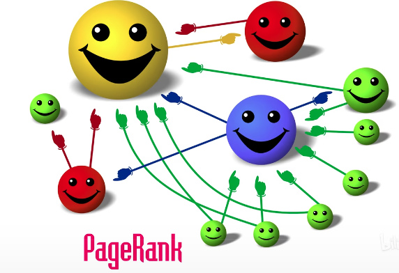
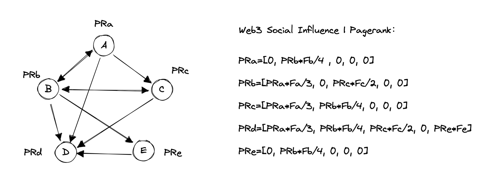

# Pagerank 算法简介

Pagerank 算法最早是Google公司所使用的对其搜索引擎搜索结果中的网页进行排名的一种算法。Pagerank 算法是一种图算法，使用递归算法充分考虑了每个节点的影响力作用，其使用 In-coming Links 作为核心指标，屏蔽了诸多作弊可能性，被称为民主自治算法。社交网络也是一种复杂的图网络，与网页排名类似，因此可以使用 Pagerank 算法进行社交网络中节点影响力的评估。

# 评估 Twitter 用户社交影响力

上图中$a、b、c、d、e$ 指5个用户， $PRa、PRb、PRc、PRd、PRe$ 指5个用户的Pagerank 值，即影响力。$Fa、Fb、Fc、Fd、Fe$指五个用户的其他权重。

Twitter 主要通过 Follow（Out-going Links） 和被 Follow（In-coming Links） 来标记用户关系，而 Follow 是可以主动控制的动作，在 Pagerank 中不以此指标计算，因此采用被 Follow 数据作为核心指标参与计算。

# 评估用户在垂直领域中的影响力

评估一个用户在一个垂直领域中的影响力，需对用户进行三个方面的评估：

- 社交影响力：将用户社交影响力量化，用于计算用户发布/转发内容行为的重要程度，即基本价值。
- 金融潜力：通过链上数据，计算用户的资产价值和金融行为活跃度，该指数影响该用户关联用户的社交影响力，以及该用户的行为价值（金融潜力影响最终转化率）。
- 领域标签：通过历史内容和链上数据将用户标签化，旨在为广告主筛选更精准的传播节点。

金融潜力和领域标签可通过用户链上信息获取，主要因素包括：
- 资产种类
- 资产数量
- 交易活跃度
- Dapp 活跃度
- 
# 评估内容价值

主要从传播范围、传播精准度和传播效果三个方面对内容进行评估。

- 传播范围：指内容的有效浏览数。
- 传播效果：即观众共鸣，由内容互动（评论、点赞、转发）数据加权得出。
- 传播精准度：指浏览和互动用户的专业标签与目标的重合度，经济潜力。
- 
基于以上三种因素进行建模，可构建简单的内容模型，但由于浏览、点赞等内容容易造假，因此一条内容的整体价值需要结合发布内容用户的影响力来整体计算。
